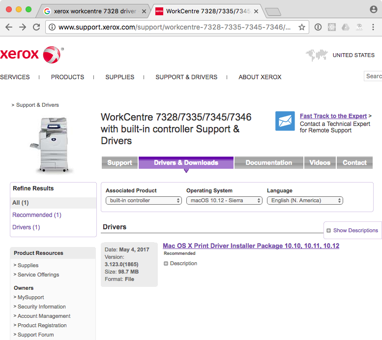
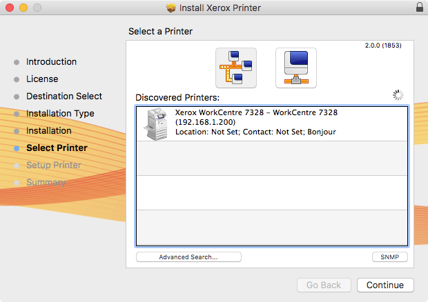
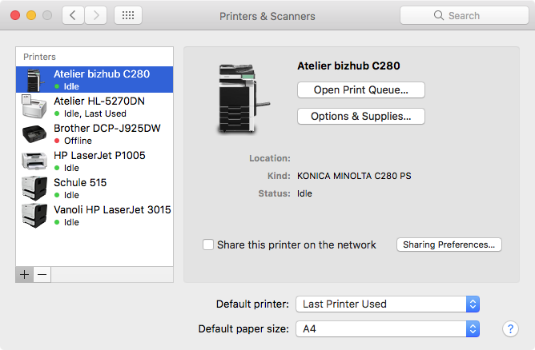
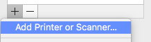
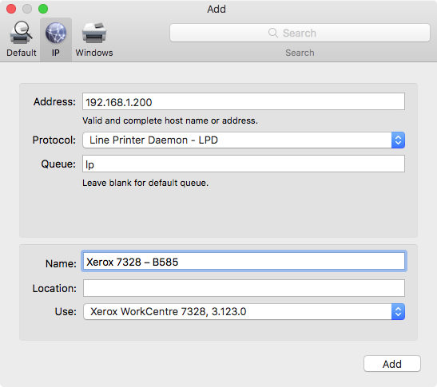
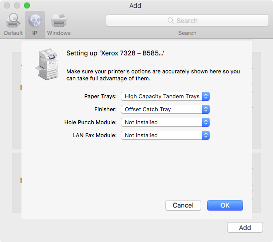
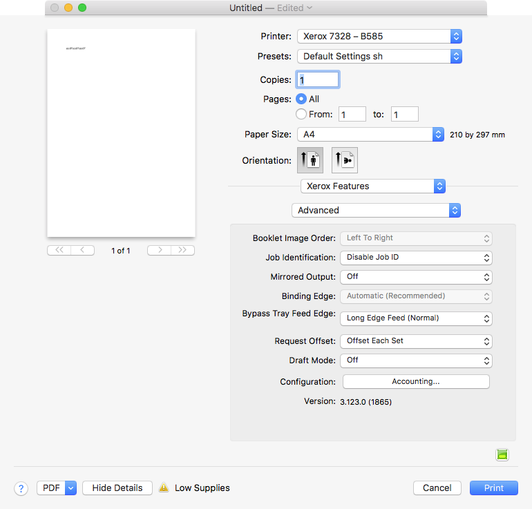
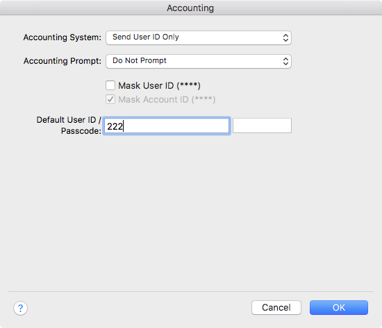

## Xerox – WorkCentre 7328

### Driver
From xerox.com [Download Driver](http://www.support.xerox.com/support/workcentre-7328-7335-7345-7346/downloads/enus.html?operatingSystem=macos1012&associatedProduct=workcentre-7328-35-45-46-built-in-controller)

### Installation
**DON'T** select a printer press continue!
 

### Add a printer

### IP settings

### Printer settings

### for printing

